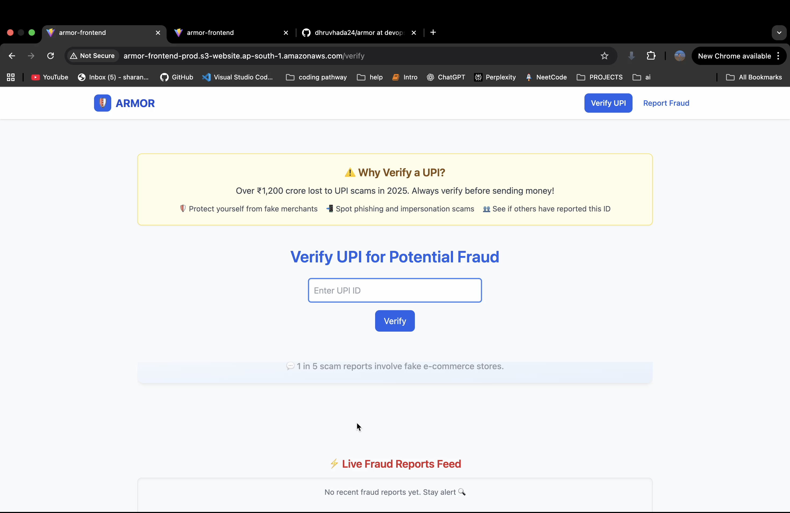
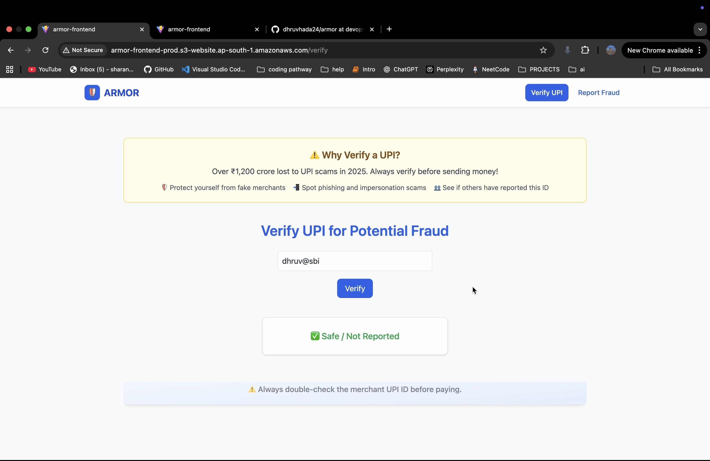
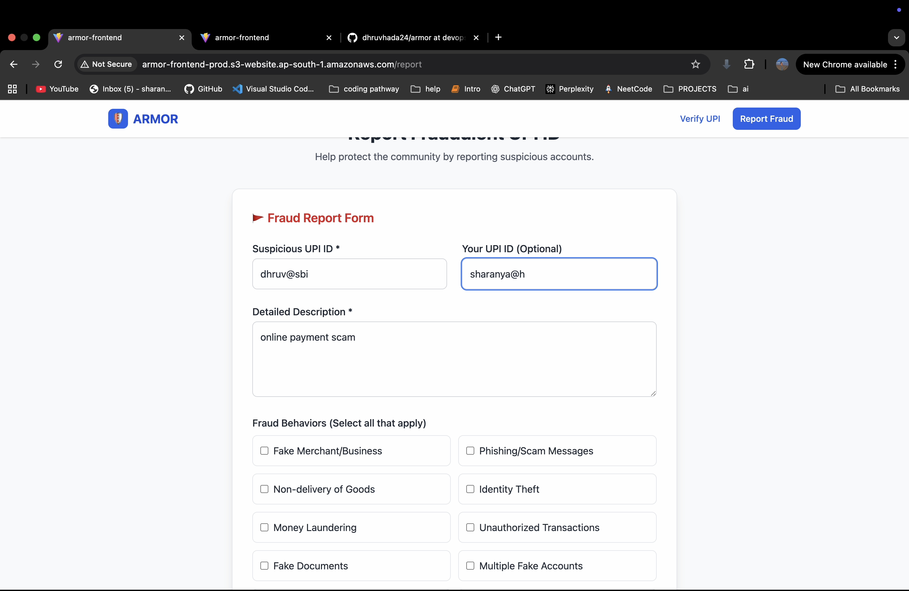
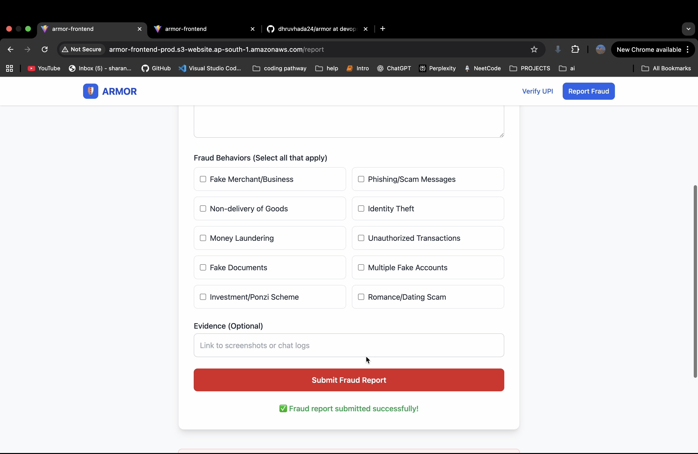
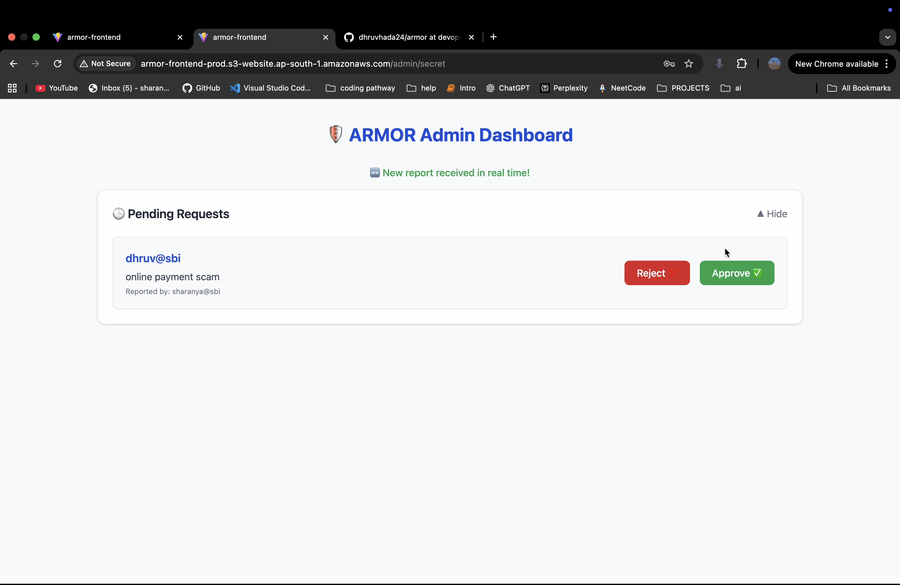
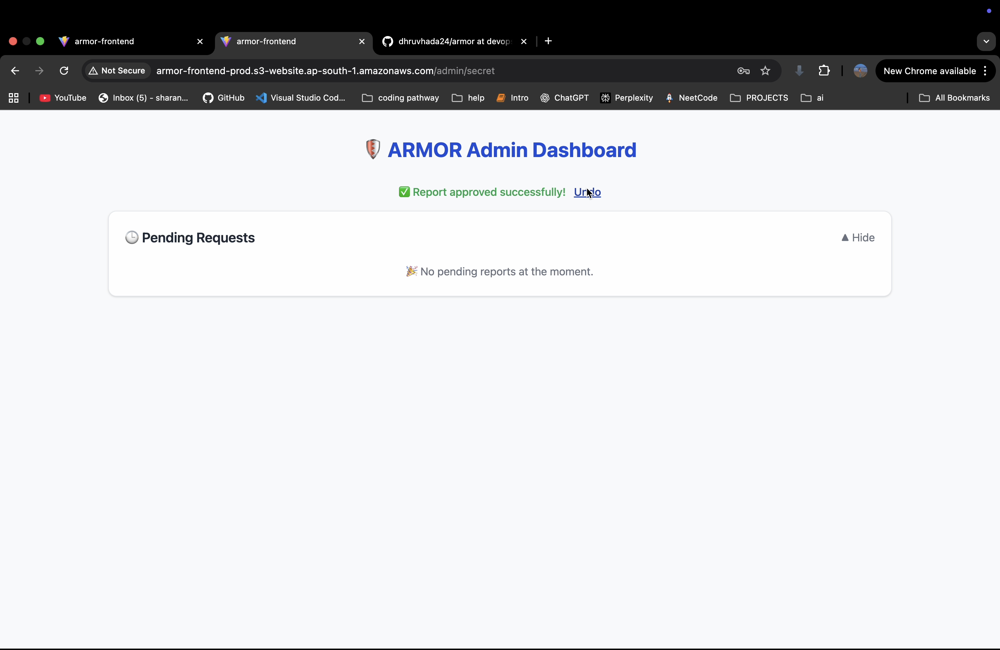
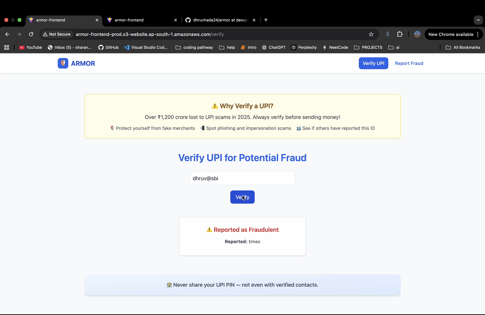

# ARMOR — Advanced Risk Mitigation for Online Remittance

ARMOR is a cloud-based fraud detection and reporting platform designed to detect, verify, and report fraudulent UPI transactions in real time.  
It integrates adaptive machine learning, scalable AWS microservices, and CI/CD pipelines for secure financial transaction monitoring.

---

## Tech Stack

| Category | Tools & Technologies |
|-----------|---------------------|
| **Frontend** | React (Vite), Tailwind CSS, AWS S3 + CloudFront |
| **Backend** | Node.js (Express), MongoDB Atlas |
| **Infrastructure** | Terraform, AWS ECS + ECR, ALB, IAM, CloudWatch |
| **DevOps** | Docker, GitHub Actions, CI/CD Pipelines |
| **Security** | JWT Auth, Winston Logger, HTTPS via AWS ACM |

---

## Screenshots

| Description | Preview |
|--------------|----------|
| **Home Page — Verify UPI** |  |
| **Verified as Safe** |  |
| **Reported as Fraudulent** |  |
| **Fraud Report Form** |  |
| **Report Submitted** |  |
| **Admin Dashboard — Pending** |  |
| **Admin Dashboard — Approved** |  |

---

## Deployment Architecture
- **Frontend:** Hosted on AWS S3 + CloudFront  
- **Backend:** Containerized on AWS ECS (Fargate)  
- **Automation:** CI/CD via GitHub Actions + Terraform  
- **Monitoring:** AWS CloudWatch + Centralized Logging  

---

## Contributors
- **Sharanya Katna** – DevOps, CI/CD, Terraform, AWS Cloud Infrastructure  
- **Dhruv Hada** – Backend Development, Fraud Detection Logic  

---

## Repository
[https://github.com/sharanyakatna/armor](https://github.com/sharanyakatna/armor)
